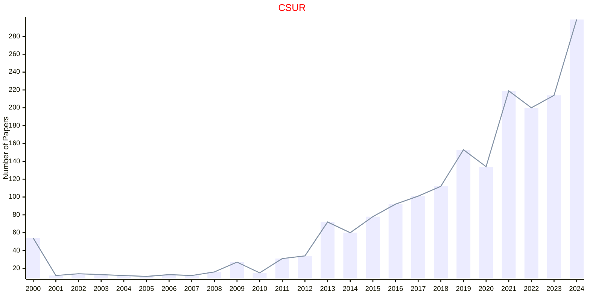
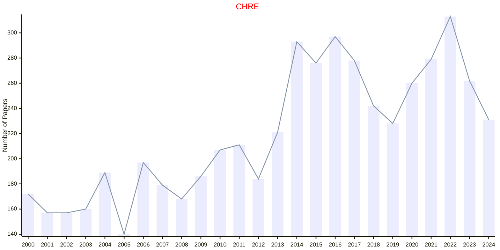
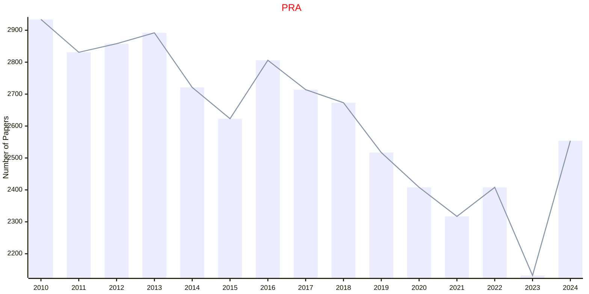
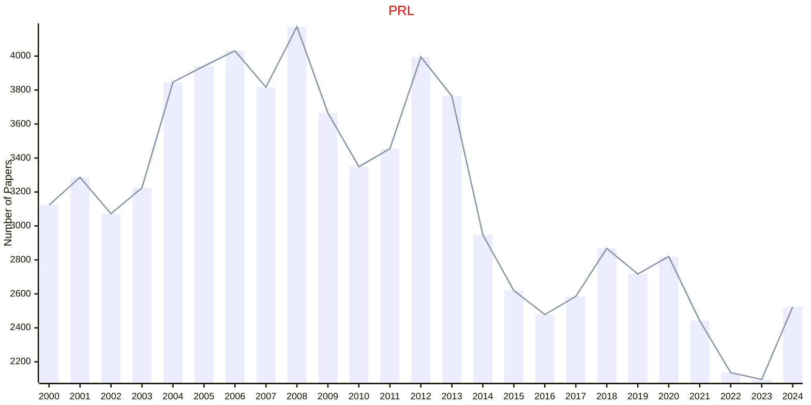
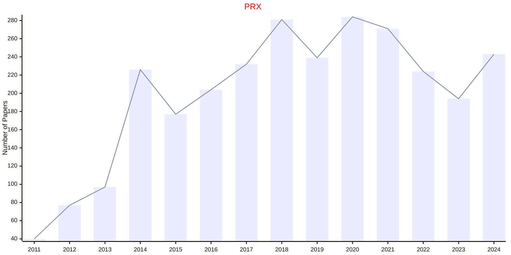
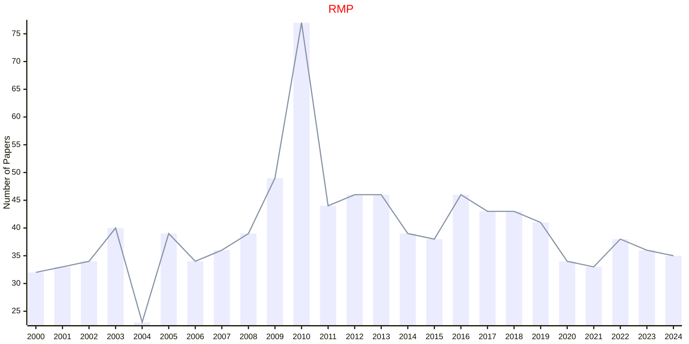
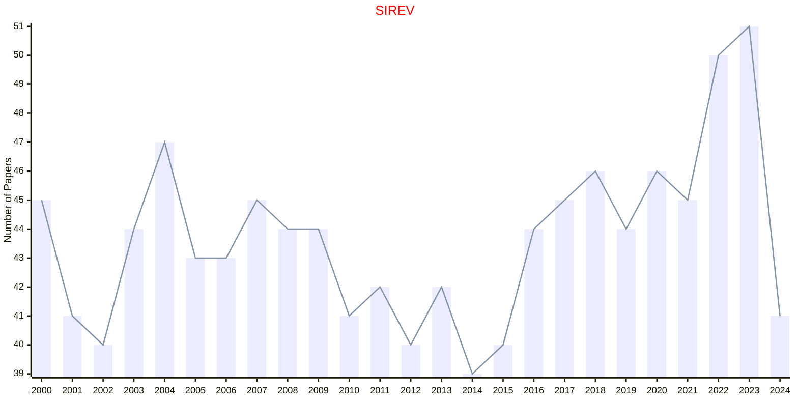
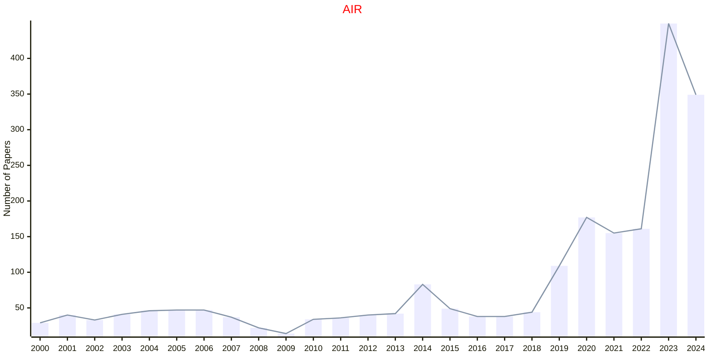
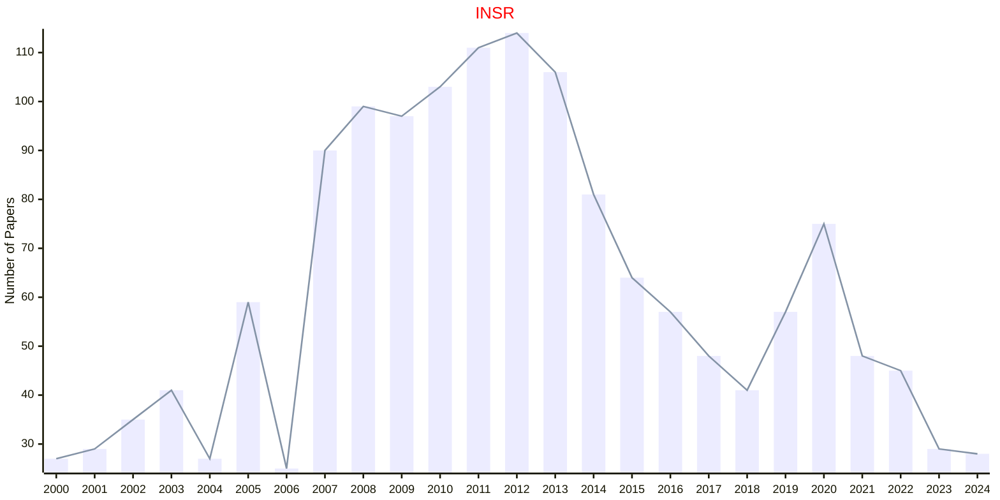
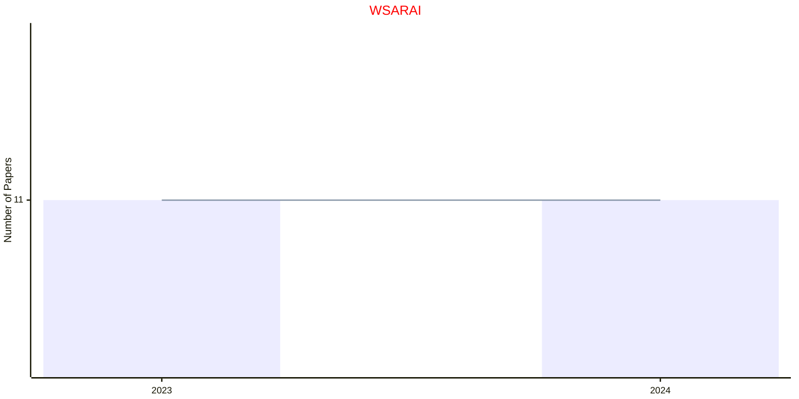

# Review and Survey

## CSUR

|Publishers|Full/Homepage|Abbr/About|Acronym/Issues|Period/DBLP|Top/Early|CCF|CAS|JCR|IF|Keywords/Google|
|-         |-            |-         |-             |-          |-        |-  |-  |-  |- |-              |
|[ACM](https://www.acm.org/)|[ACM Computing Surveys](https://dl.acm.org/journal/csur)|[ACM Comput. Surv.](https://dl.acm.org/journal/csur)|[CSUR](https://dl.acm.org/loi/csur)|[1969 -](https://dblp.org/db/journals/csur/index.html)|True||1|Q1|26.3|[Computer Science](https://www.google.com/search?q=Computer+Science)|

## CHRE

|Publishers|Full/Homepage|Abbr/About|Acronym/Issues|Period/DBLP|Top/Early|CCF|CAS|JCR|IF|Keywords/Google|
|-         |-            |-         |-             |-          |-        |-  |-  |-  |- |-              |
|[ACS](https://www.acs.org/)|[Chemical Reviews](https://pubs.acs.org/journal/chreay)|[Chem. Rev.](https://pubs.acs.org/page/chreay/about.html)|[CHRE](https://pubs.acs.org/loi/chreay)|1924 -|True||1|Q1|67.5|[Chemical Reviews](https://www.google.com/search?q=Chemical+Reviews); [Chemistry](https://www.google.com/search?q=Chemistry)|

## PRA

|Publishers|Full/Homepage|Abbr/About|Acronym/Issues|Period/DBLP|Top/Early|CCF|CAS|JCR|IF|Keywords/Google|
|-         |-            |-         |-             |-          |-        |-  |-  |-  |- |-              |
|[APS](https://journals.aps.org)|[Physical Review A](https://journals.aps.org/pra)|[Phys. Rev. A](https://journals.aps.org/pra/about)|[PRA](https://journals.aps.org/pra/issues)|1970 -|False||2|Q2|3.0|[Physical Review](https://www.google.com/search?q=Physical+Review); [Physics](https://www.google.com/search?q=Physics)|

## PRL

|Publishers|Full/Homepage|Abbr/About|Acronym/Issues|Period/DBLP|Top/Early|CCF|CAS|JCR|IF|Keywords/Google|
|-         |-            |-         |-             |-          |-        |-  |-  |-  |- |-              |
|[APS](https://journals.aps.org)|[Physical Review Letters](https://journals.aps.org/prl)|[Phys. Rev. Lett.](https://journals.aps.org/prl/about)|[PRL](https://journals.aps.org/prl/issues)|1958 -|True||1|Q1|9.1|[Physical Review](https://www.google.com/search?q=Physical+Review); [Physics](https://www.google.com/search?q=Physics)|

## PRX

|Publishers|Full/Homepage|Abbr/About|Acronym/Issues|Period/DBLP|Top/Early|CCF|CAS|JCR|IF|Keywords/Google|
|-         |-            |-         |-             |-          |-        |-  |-  |-  |- |-              |
|[APS](https://journals.aps.org)|[Physical Review X](https://journals.aps.org/prx)|[Phys. Rev. X](https://journals.aps.org/prx/about)|[PRX](https://journals.aps.org/prx/issues)|2011 -|True||1|Q1|15.4|[Physical Review](https://www.google.com/search?q=Physical+Review); [Physics](https://www.google.com/search?q=Physics)|

## RMP

|Publishers|Full/Homepage|Abbr/About|Acronym/Issues|Period/DBLP|Top/Early|CCF|CAS|JCR|IF|Keywords/Google|
|-         |-            |-         |-             |-          |-        |-  |-  |-  |- |-              |
|[APS](https://journals.aps.org)|[Review Modern Physics](https://journals.aps.org/rmp)|[Rev. Mod. Phys.](https://journals.aps.org/rmp/about)|[RMP](https://journals.aps.org/rmp/issues)|1929 -|False|||||[Physical Review](https://www.google.com/search?q=Physical+Review); [Physics](https://www.google.com/search?q=Physics)|

## PS

|Publishers|Full/Homepage|Abbr/About|Acronym/Issues|Period/DBLP|Top/Early|CCF|CAS|JCR|IF|Keywords/Google|
|-         |-            |-         |-             |-          |-        |-  |-  |-  |- |-              |
|[EUCLID](https://projecteuclid.org)|[Probability Surveys](https://imstat.org/journals-and-publications/probability-surveys/)|[Probab. Surv.](https://imstat.org/journals-and-publications/probability-surveys/)|[PS](https://projecteuclid.org/journals/probability-surveys/issues)|2004 -|False||2||2.0|[Probability](https://www.google.com/search?q=Probability); [Probability and Statistics](https://www.google.com/search?q=Probability+and+Statistics)|

## SS

|Publishers|Full/Homepage|Abbr/About|Acronym/Issues|Period/DBLP|Top/Early|CCF|CAS|JCR|IF|Keywords/Google|
|-         |-            |-         |-             |-          |-        |-  |-  |-  |- |-              |
|[EUCLID](https://projecteuclid.org)|[Statistics Surveys](https://imstat.org/journals-and-publications/statistics-surveys/)|[Stat. Surv.](https://imstat.org/journals-and-publications/statistics-surveys/)|[SS](https://projecteuclid.org/journals/statistics-surveys/issues)|2007 -|False||2||9.4|[Probability and Statistics](https://www.google.com/search?q=Probability+and+Statistics); [Statistics](https://www.google.com/search?q=Statistics)|

## SIREV

|Publishers|Full/Homepage|Abbr/About|Acronym/Issues|Period/DBLP|Top/Early|CCF|CAS|JCR|IF|Keywords/Google|
|-         |-            |-         |-             |-          |-        |-  |-  |-  |- |-              |
|[SIAM](https://epubs.siam.org)|[SIAM Review](https://epubs.siam.org/journal/siread)|[SIAM Rev.](https://epubs.siam.org/journal/sirev/about)|[SIREV](https://epubs.siam.org/loi/siread)|1959 -|True||1|Q1|11.1|[Mathematics](https://www.google.com/search?q=Mathematics); [Review](https://www.google.com/search?q=Review)|

## AIR

|Publishers|Full/Homepage|Abbr/About|Acronym/Issues|Period/DBLP|Top/Early|CCF|CAS|JCR|IF|Keywords/Google|
|-         |-            |-         |-             |-          |-        |-  |-  |-  |- |-              |
|[SPRINGER](https://www.springer.com/)|[Artificial Intelligence Review](https://www.springer.com/journal/10462)|[Artif. Intell. Rev.](https://www.springer.com/journal/10462/aims-and-scope)|[AIR](https://link.springer.com/journal/10462/volumes-and-issues)|1987 -|True||1|Q1|14.9|[Artificial Intelligence](https://www.google.com/search?q=Artificial+Intelligence); [Review](https://www.google.com/search?q=Review)|

## INSR

|Publishers|Full/Homepage|Abbr/About|Acronym/Issues|Period/DBLP|Top/Early|CCF|CAS|JCR|IF|Keywords/Google|
|-         |-            |-         |-             |-          |-        |-  |-  |-  |- |-              |
|[WILEY](https://www.wiley.com/)|[International Statistical Review](https://onlinelibrary.wiley.com/journal/17515823)|[Int. Stat. Rev.](https://onlinelibrary.wiley.com/page/journal/17515823/homepage/productinformation.html)|[INSR](https://onlinelibrary.wiley.com/loi/17515823)|1997 -|False||4|Q1|2.4|[Statistics](https://www.google.com/search?q=Statistics)|

## WSARAI

|Publishers|Full/Homepage|Abbr/About|Acronym/Issues|Period/DBLP|Top/Early|CCF|CAS|JCR|IF|Keywords/Google|
|-         |-            |-         |-             |-          |-        |-  |-  |-  |- |-              |
|[WS](https://worldscientific.com/)|[World Scientific Annual Review of Artificial Intelligence](https://worldscientific.com/worldscinet/wsarai)|[World Sci. Ann. Rev. Artif. Intell.](https://worldscientific.com/page/wsarai/aims-scope)|[WSARAI](https://worldscientific.com/loi/wsarai)|2023 -|False|||||[Artificial Intelligence](https://www.google.com/search?q=Artificial+Intelligence)|

