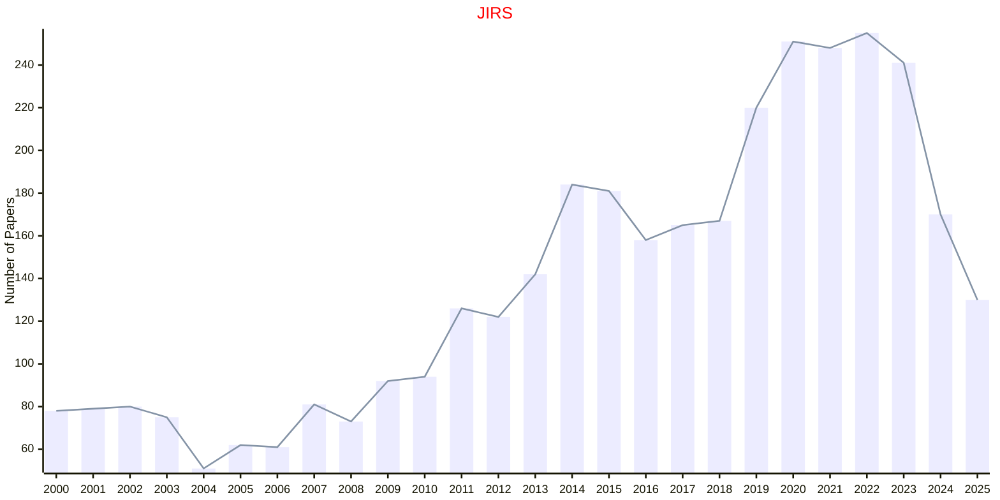

# Robotic Systems

## JIRS

|Publishers|Full/Homepage|Abbr/About|Acronym/Issues|Period/DBLP|Top/Early|CCF|CAS|JCR|IF|Keywords/Google|
|-         |-            |-         |-             |-          |-        |-  |-  |-  |- |-              |
|[SPRINGER](https://www.springer.com/)|[Journal of Intelligent & Robotic Systems](https://www.springer.com/journal/10846)|[J. Intell. Robot. Syst.](https://www.springer.com/journal/10846/aims-and-scope)|[JIRS](https://link.springer.com/journal/10846/volumes-and-issues)|1988 -|False||4|Q3|3.2|[Robotic Systems](https://www.google.com/search?q=Robotic+Systems)|

