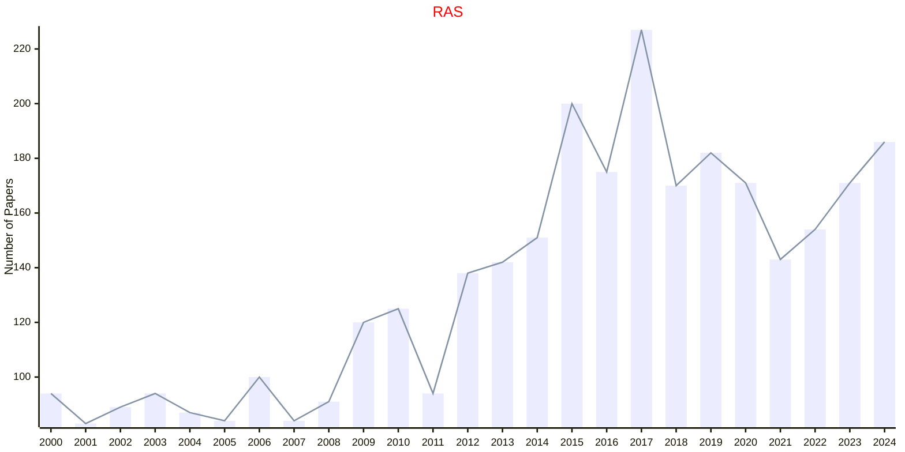

# Robotics

## RAS

|Publishers|Full/Homepage|Abbr/About|Acronym/Issues|Period/DBLP|Top/Early|CCF|CAS|JCR|IF|Keywords/Google|
|-         |-            |-         |-             |-          |-        |-  |-  |-  |- |-              |
|[ELSEVIER](https://www.sciencedirect.com/)|[Robotics and Autonomous Systems](https://www.sciencedirect.com/journal/robotics-and-autonomous-systems)|[Robot. Auton. Syst.](https://www.sciencedirect.com/journal/robotics-and-autonomous-systems/about/aims-and-scope)|[RAS](https://www.sciencedirect.com/journal/robotics-and-autonomous-systems/issues)|1988 -|False||2|Q1|5.1|[Robotics](https://www.google.com/search?q=Robotics)|

