# Robotics and UAV

## SROB

|Publishers|Full/Homepage|Abbr/About|Acronym/Issues|Period/DBLP|Top/Early|CCF|CAS|JCR|IF|Keywords/Google|
|-         |-            |-         |-             |-          |-        |-  |-  |-  |- |-              |
|[AAAS](https://www.science.org/)|[Science Robotics](https://www.science.org/journal/scirobotics)|[Sci. Robot.](https://www.science.org/content/page/science-robotics-mission-and-scope)|[SROB](https://www.science.org/loi/scirobotics)|2016 -|True||1|Q1|32.9|[Robotics and UAV](https://www.google.com/search?q=Robotics+and+UAV)|

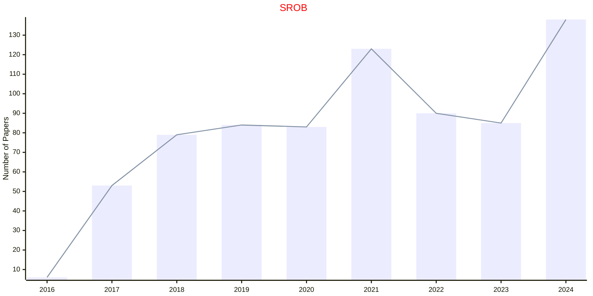

## RAS

|Publishers|Full/Homepage|Abbr/About|Acronym/Issues|Period/DBLP|Top/Early|CCF|CAS|JCR|IF|Keywords/Google|
|-         |-            |-         |-             |-          |-        |-  |-  |-  |- |-              |
|[ELSEVIER](https://www.sciencedirect.com/)|[Robotics and Autonomous Systems](https://www.sciencedirect.com/journal/robotics-and-autonomous-systems)|[Robot. Auton. Syst.](https://www.sciencedirect.com/journal/robotics-and-autonomous-systems/about/aims-and-scope)|[RAS](https://www.sciencedirect.com/journal/robotics-and-autonomous-systems/issues)|1988 -|False||2|Q1|5.1|[Robotics](https://www.google.com/search?q=Robotics)|

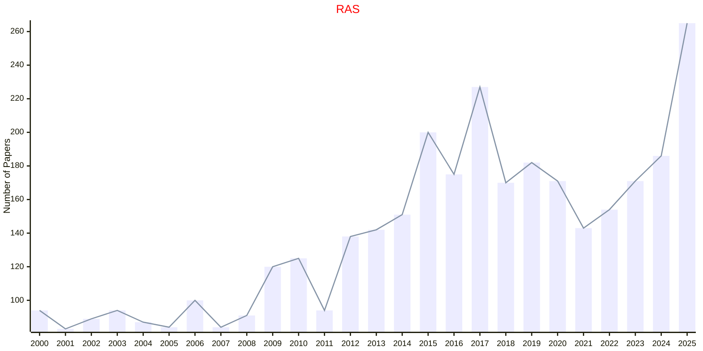

## FROBT

|Publishers|Full/Homepage|Abbr/About|Acronym/Issues|Period/DBLP|Top/Early|CCF|CAS|JCR|IF|Keywords/Google|
|-         |-            |-         |-             |-          |-        |-  |-  |-  |- |-              |
|[FRONTIERS](https://www.frontiersin.org/)|[Frontiers in Robotics and AI](https://www.frontiersin.org/journals/robotics-and-ai)|[Front. Robot. AI](https://www.frontiersin.org/journals/robotics-and-ai/about)|[FROBT](https://www.frontiersin.org/journals/robotics-and-ai/volumes)|2014 -|False||4||4.0|[Ambient Intelligence](https://www.google.com/search?q=Ambient+Intelligence); [Robotics and UAV](https://www.google.com/search?q=Robotics+and+UAV)|

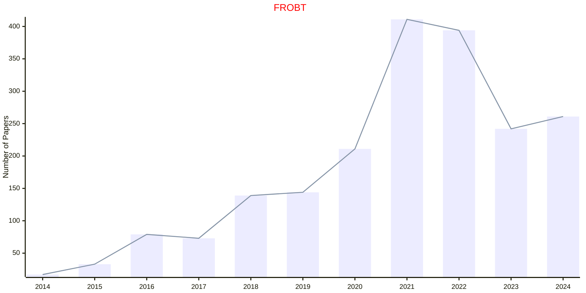

## MRA

|Publishers|Full/Homepage|Abbr/About|Acronym/Issues|Period/DBLP|Top/Early|CCF|CAS|JCR|IF|Keywords/Google|
|-         |-            |-         |-             |-          |-        |-  |-  |-  |- |-              |
|[IEEE](https://ieeexplore.ieee.org/)|[IEEE Robotics and Automation Magazine](https://ieeexplore.ieee.org/xpl/RecentIssue.jsp?punumber=100)|[IEEE Robot. Autom. Mag.](https://ieeexplore.ieee.org/xpl/aboutJournal.jsp?punumber=100)|[MRA](https://ieeexplore.ieee.org/xpl/issues?punumber=100&isnumber=10931179)|1994 -|[False](https://ieeexplore.ieee.org/xpl/tocresult.jsp?isnumber=4600619)||3|Q1|7.3|[Robotics and UAV](https://www.google.com/search?q=Robotics+and+UAV)|

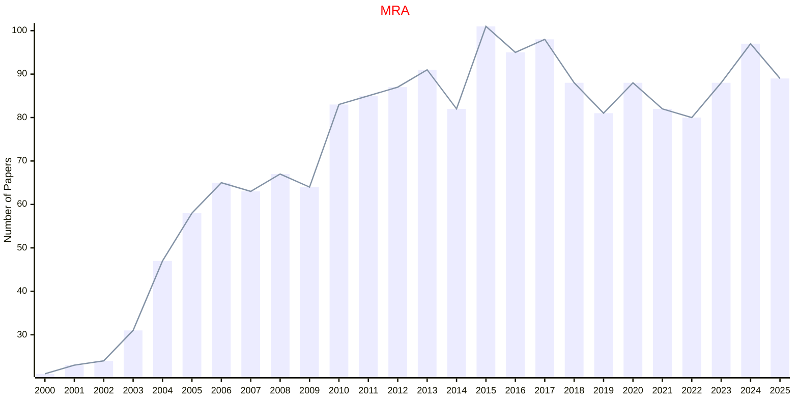

## TMRB

|Publishers|Full/Homepage|Abbr/About|Acronym/Issues|Period/DBLP|Top/Early|CCF|CAS|JCR|IF|Keywords/Google|
|-         |-            |-         |-             |-          |-        |-  |-  |-  |- |-              |
|[IEEE](https://ieeexplore.ieee.org/)|[IEEE Transactions on Medical Robotics and Bionics](https://ieeexplore.ieee.org/xpl/RecentIssue.jsp?punumber=8253409)|[IEEE Tran. Med. Robot. Bionics](https://ieeexplore.ieee.org/xpl/aboutJournal.jsp?punumber=8253409)|[TMRB](https://ieeexplore.ieee.org/xpl/issues?punumber=8253409&isnumber=10908098)|2019 -|[False](https://ieeexplore.ieee.org/xpl/tocresult.jsp?isnumber=8627956)||3||4.2|[Medical Robotics](https://www.google.com/search?q=Medical+Robotics)|

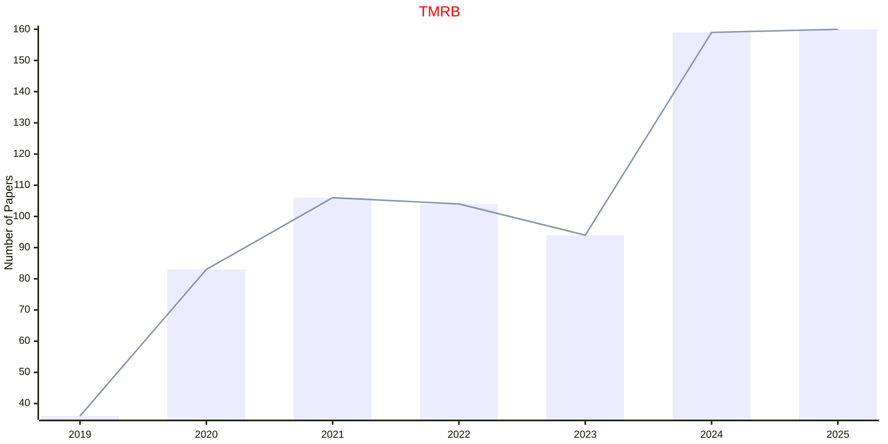

## TRA

|Publishers|Full/Homepage|Abbr/About|Acronym/Issues|Period/DBLP|Top/Early|CCF|CAS|JCR|IF|Keywords/Google|
|-         |-            |-         |-             |-          |-        |-  |-  |-  |- |-              |
|[IEEE](https://ieeexplore.ieee.org/)|[IEEE Transactions on Robotics and Automation](https://ieeexplore.ieee.org/xpl/RecentIssue.jsp?punumber=70)|[IEEE Trans. Robot. Autom.](https://ieeexplore.ieee.org/xpl/aboutJournal.jsp?punumber=70)|TRA|1989 - 2004|False|||||[Robotics and UAV](https://www.google.com/search?q=Robotics+and+UAV)|

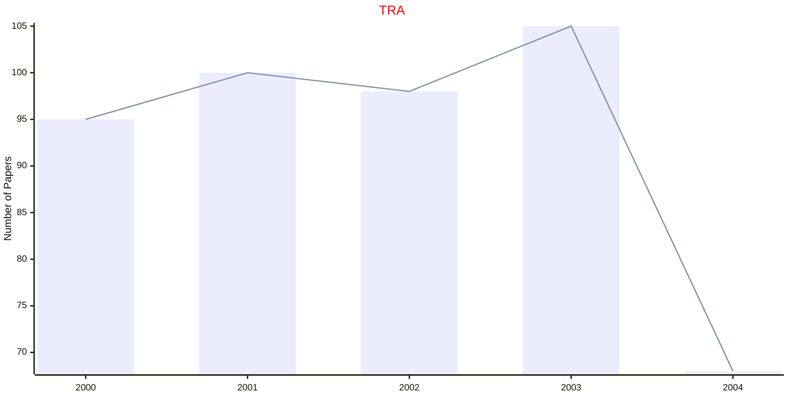

## TROB

|Publishers|Full/Homepage|Abbr/About|Acronym/Issues|Period/DBLP|Top/Early|CCF|CAS|JCR|IF|Keywords/Google|
|-         |-            |-         |-             |-          |-        |-  |-  |-  |- |-              |
|[IEEE](https://ieeexplore.ieee.org/)|[IEEE Transactions on Robotics](https://ieeexplore.ieee.org/xpl/RecentIssue.jsp?punumber=8860)|[IEEE Trans. Robot.](https://ieeexplore.ieee.org/xpl/aboutJournal.jsp?punumber=8860)|[TROB](https://ieeexplore.ieee.org/xpl/issues?punumber=8860&isnumber=10214173)|2004 -|[True](https://ieeexplore.ieee.org/xpl/tocresult.jsp?isnumber=4359257)|B|1|Q1|11.5|[Robotics and UAV](https://www.google.com/search?q=Robotics+and+UAV)|

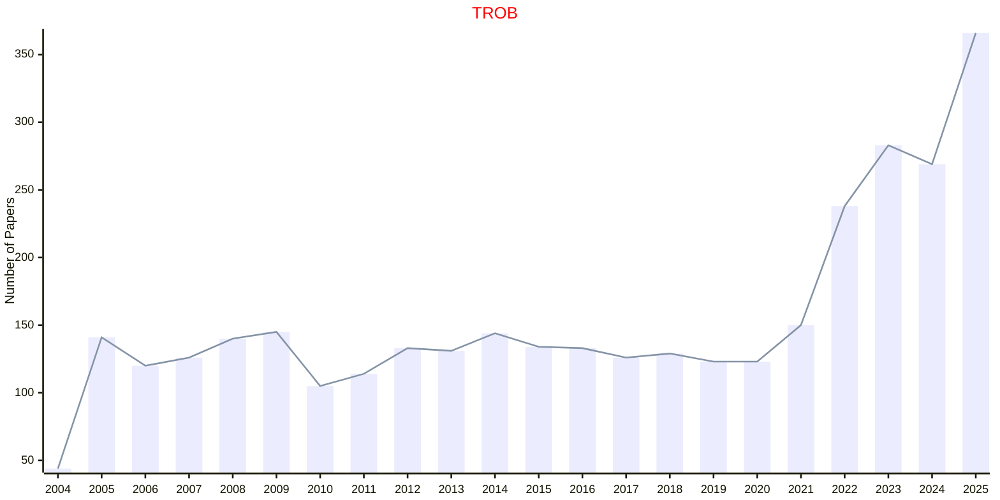

## IJARS

|Publishers|Full/Homepage|Abbr/About|Acronym/Issues|Period/DBLP|Top/Early|CCF|CAS|JCR|IF|Keywords/Google|
|-         |-            |-         |-             |-          |-        |-  |-  |-  |- |-              |
|[SAGE](https://www.sagepub.com/)|[International Journal of Advanced Robotic Systems](https://journals.sagepub.com/home/arxa)|[Int. J. Adv. Robot. Syst.](https://journals.sagepub.com/overview-metric/ARX?)|[IJARS](https://journals.sagepub.com/loi/arxa)|2004 -|False||4|Q3|2.6|[Robotics and UAV](https://www.google.com/search?q=Robotics+and+UAV)|

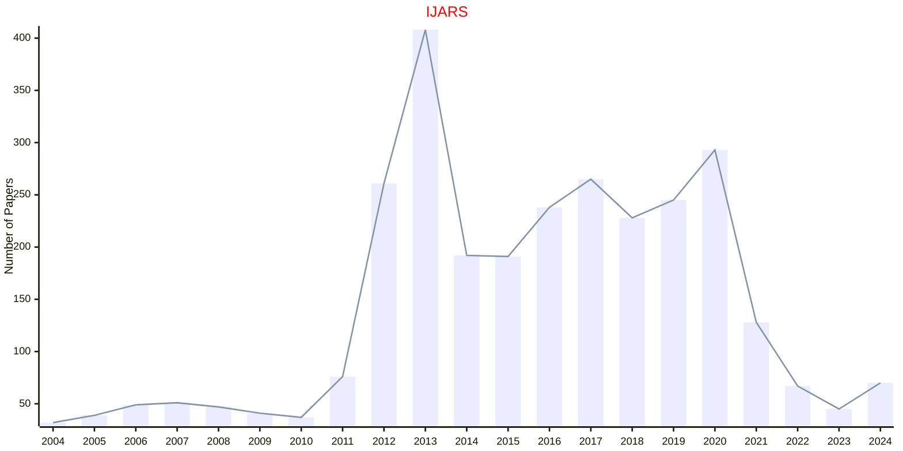

## IJRR

|Publishers|Full/Homepage|Abbr/About|Acronym/Issues|Period/DBLP|Top/Early|CCF|CAS|JCR|IF|Keywords/Google|
|-         |-            |-         |-             |-          |-        |-  |-  |-  |- |-              |
|[SAGE](https://www.sagepub.com/)|[International Journal of Robotics Research](https://journals.sagepub.com/home/ijr)|[Int. J. Robot. Res.](https://journals.sagepub.com/overview-metric/IJR?)|[IJRR](https://journals.sagepub.com/loi/ijr)|1982 -|False||2|Q2|9.3|[Robotics and UAV](https://www.google.com/search?q=Robotics+and+UAV)|

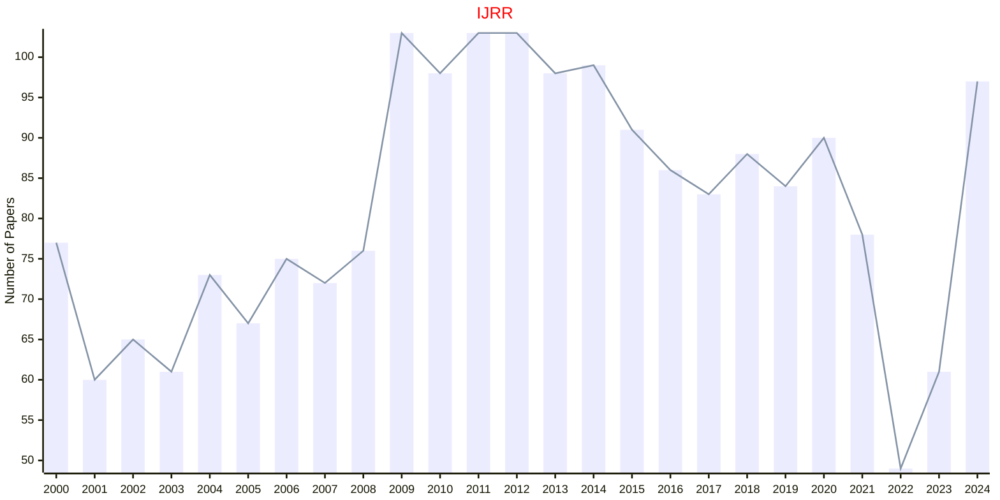

## AR

|Publishers|Full/Homepage|Abbr/About|Acronym/Issues|Period/DBLP|Top/Early|CCF|CAS|JCR|IF|Keywords/Google|
|-         |-            |-         |-             |-          |-        |-  |-  |-  |- |-              |
|[SPRINGER](https://www.springer.com/)|[Autonomous Robots](https://www.springer.com/journal/10514)|[Auton. Robot.](https://www.springer.com/journal/10514/aims-and-scope)|[AR](https://link.springer.com/journal/10514/volumes-and-issues)|1994 -|False||3|Q2|3.9|[Control and Automation](https://www.google.com/search?q=Control+and+Automation); [Robotics and UAV](https://www.google.com/search?q=Robotics+and+UAV)|

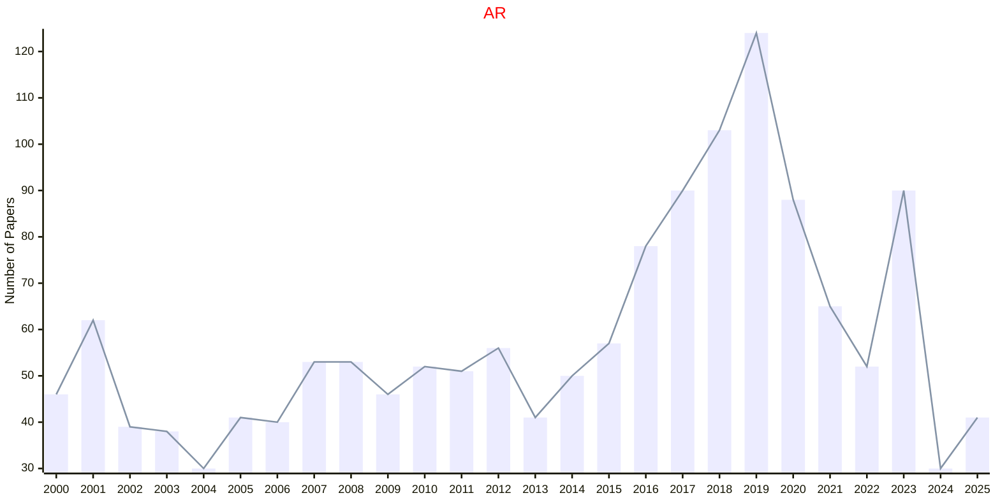

## JIRS

|Publishers|Full/Homepage|Abbr/About|Acronym/Issues|Period/DBLP|Top/Early|CCF|CAS|JCR|IF|Keywords/Google|
|-         |-            |-         |-             |-          |-        |-  |-  |-  |- |-              |
|[SPRINGER](https://www.springer.com/)|[Journal of Intelligent & Robotic Systems](https://www.springer.com/journal/10846)|[J. Intell. Robot. Syst.](https://www.springer.com/journal/10846/aims-and-scope)|[JIRS](https://link.springer.com/journal/10846/volumes-and-issues)|1988 -|False||4|Q3|3.2|[Robotic Systems](https://www.google.com/search?q=Robotic+Systems)|

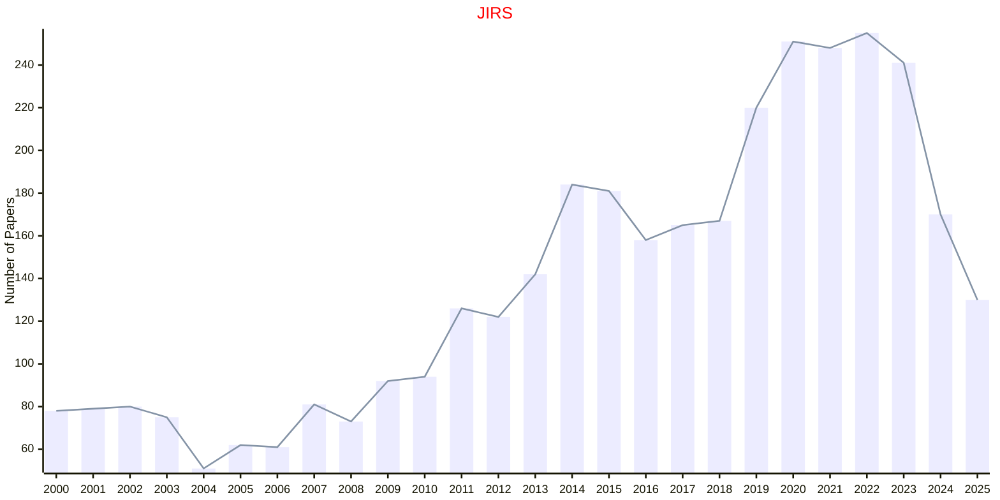

## IJAIRR

|Publishers|Full/Homepage|Abbr/About|Acronym/Issues|Period/DBLP|Top/Early|CCF|CAS|JCR|IF|Keywords/Google|
|-         |-            |-         |-             |-          |-        |-  |-  |-  |- |-              |
|[WS](https://worldscientific.com/)|[International Journal of Artificial Intelligence and Robotics Research](https://worldscientific.com/worldscinet/ijairr)|[Int. J. Artif. Intell. Robot. Res.](https://worldscientific.com/page/ijairr/aims-scope)|[IJAIRR](https://worldscientific.com/loi/ijairr)|2024 -|False|||||[Artificial Intelligence](https://www.google.com/search?q=Artificial+Intelligence); [Robotics and UAV](https://www.google.com/search?q=Robotics+and+UAV)|

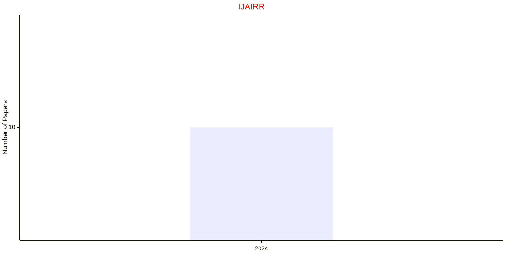

