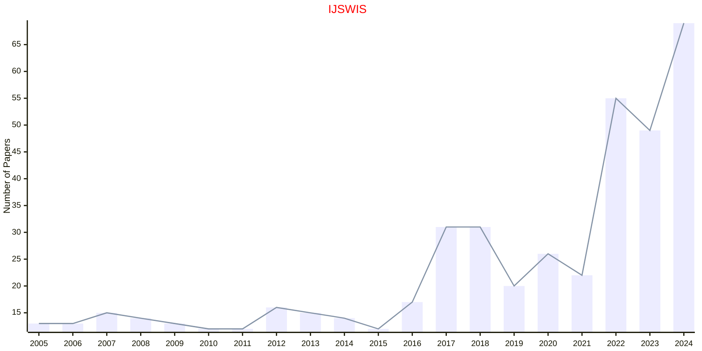
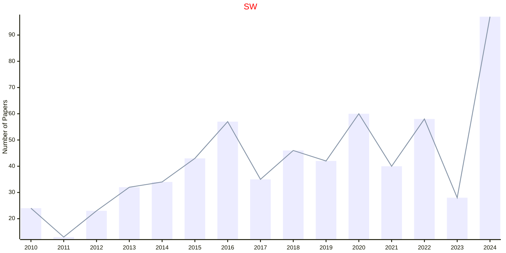

# Semantic Web

## IJSWIS

|Publishers|Full/Homepage|Abbr/About|Acronym/Issues|Period/DBLP|Top/Early|CCF|CAS|JCR|IF|Keywords/Google|
|-         |-            |-         |-             |-          |-        |-  |-  |-  |- |-              |
|[IGI](https://www.igi-global.com/)|[International Journal on Semantic Web and Information Systems](https://www.igi-global.com/journal/international-journal-semantic-web-information/1092)|[Int. J. Semantic Web Inf. Syst.](https://www.igi-global.com/journal/international-journal-semantic-web-information/1092#description)|[IJSWIS](https://www.igi-global.com/journals/open-access/table-of-contents/international-journal-semantic-web-information/1092)|2005 -|False|C|2|Q1|3.9|[Information Systems](https://www.google.com/search?q=Information+Systems); [Semantic Web](https://www.google.com/search?q=Semantic+Web)|

## SW

|Publishers|Full/Homepage|Abbr/About|Acronym/Issues|Period/DBLP|Top/Early|CCF|CAS|JCR|IF|Keywords/Google|
|-         |-            |-         |-             |-          |-        |-  |-  |-  |- |-              |
|[SAGE](https://www.sagepub.com/)|[Semantic Web](https://journals.sagepub.com/home/swj)|[Semantic Web](https://journals.sagepub.com/overview-metric/SWJ?)|[SW](https://journals.sagepub.com/loi/swj)|2010 -|False||3|Q2|3.0|[Semantic Web](https://www.google.com/search?q=Semantic+Web)|

