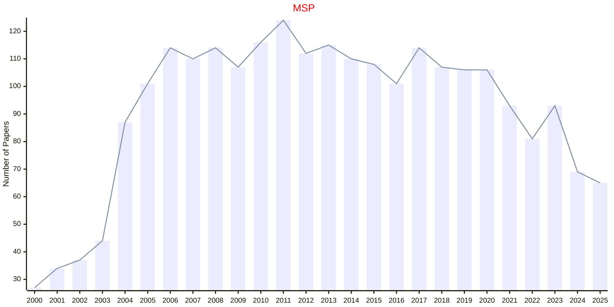
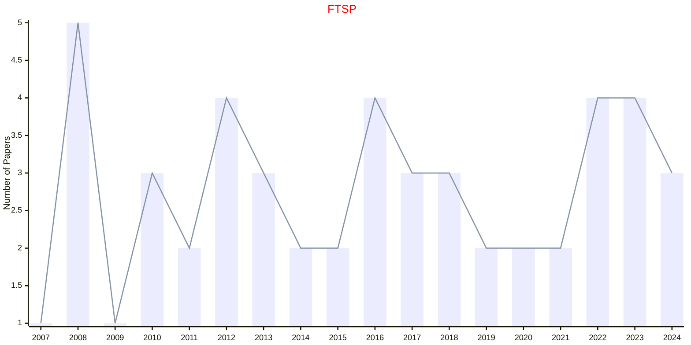

# Signal Processing

## MSP

|Publishers|Full/Homepage|Abbr/About|Acronym/Issues|Period/DBLP|Top/Early|CCF|CAS|JCR|IF|Keywords/Google|
|-         |-            |-         |-             |-          |-        |-  |-  |-  |- |-              |
|[IEEE](https://ieeexplore.ieee.org/)|[IEEE Signal Processing Magazine](https://ieeexplore.ieee.org/xpl/RecentIssue.jsp?punumber=79)|[IEEE Signal Process. Mag.](https://ieeexplore.ieee.org/xpl/aboutJournal.jsp?punumber=79)|[MSP](https://ieeexplore.ieee.org/xpl/issues?punumber=79&isnumber=10934750)|1991 -|False||2|Q1|17.1|[Signal Processing](https://www.google.com/search?q=Signal+Processing)|

## FTSP

|Publishers|Full/Homepage|Abbr/About|Acronym/Issues|Period/DBLP|Top/Early|CCF|CAS|JCR|IF|Keywords/Google|
|-         |-            |-         |-             |-          |-        |-  |-  |-  |- |-              |
|[NOW](https://www.nowpublishers.com/)|[Foundations and Trends in Signal Processing](https://www.nowpublishers.com/SIG)|[Found. Trends Signal Process.](https://www.nowpublishers.com/Journal/EditorialAims/SIG)|[FTSP](https://www.nowpublishers.com/SIG)|2007 -|False||4||12.0|[Signal Processing](https://www.google.com/search?q=Signal+Processing)|

