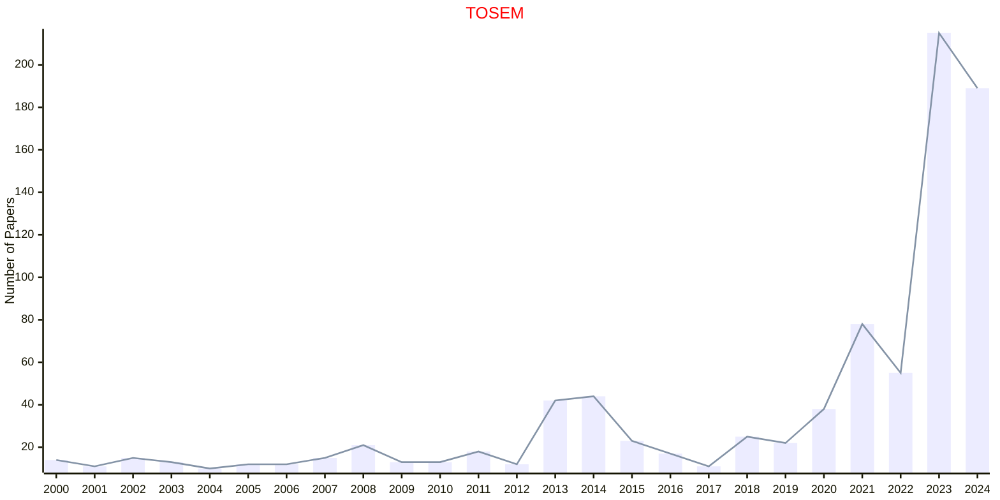
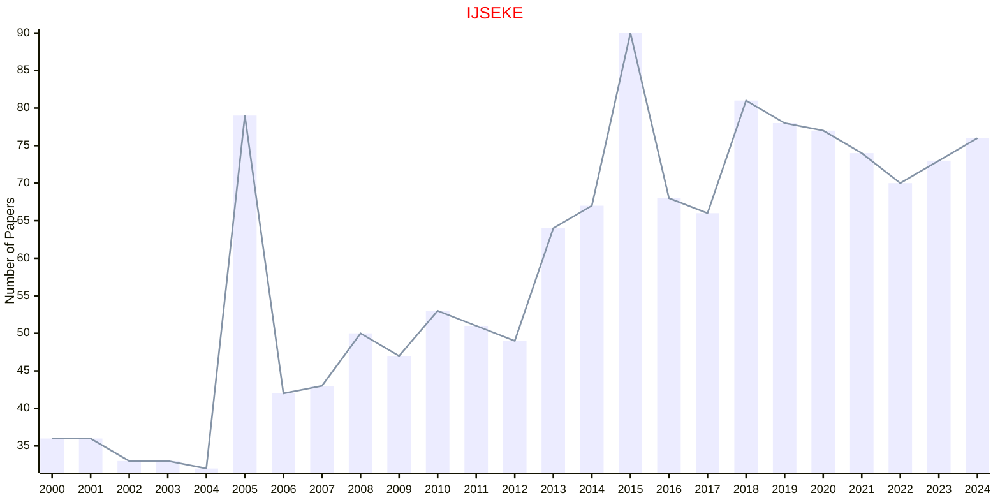

# Software Engineering

## TOSEM

|Publishers|Full/Homepage|Abbr/About|Acronym/Issues|Period/DBLP|Top/Early|CCF|CAS|JCR|IF|Keywords/Google|
|-         |-            |-         |-             |-          |-        |-  |-  |-  |- |-              |
|[ACM](https://www.acm.org/)|[ACM Transactions on Software Engineering and Methodology](https://dl.acm.org/journal/tosem)|[ACM Trans. Softw. Eng. Methodol.](https://dl.acm.org/journal/tosem/about)|[TOSEM](https://dl.acm.org/loi/tosem)|[1992 -](https://dblp.org/db/journals/tosem/index.html)|True|A|1|Q1|6.3|[Software Engineering](https://www.google.com/search?q=Software+Engineering)|

## IJSEKE

|Publishers|Full/Homepage|Abbr/About|Acronym/Issues|Period/DBLP|Top/Early|CCF|CAS|JCR|IF|Keywords/Google|
|-         |-            |-         |-             |-          |-        |-  |-  |-  |- |-              |
|[WS](https://worldscientific.com/)|[International Journal of Software Engineering and Knowledge Engineering](https://worldscientific.com/worldscinet/ijseke)|[Int. J. Soft. Eng. Knowl. Eng.](https://worldscientific.com/page/ijseke/aims-scope)|[IJSEKE](https://worldscientific.com/loi/ijseke)|1991 -|False|C|4|Q4|0.7|[Software Engineering](https://www.google.com/search?q=Software+Engineering)|

