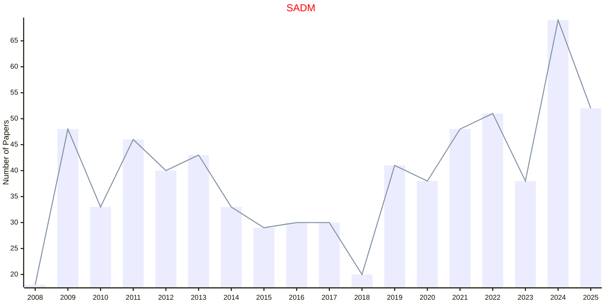

# Statistical Analysis

## SADM

|Publishers|Full/Homepage|Abbr/About|Acronym/Issues|Period/DBLP|Top/Early|CCF|CAS|JCR|IF|Keywords/Google|
|-         |-            |-         |-             |-          |-        |-  |-  |-  |- |-              |
|[WILEY](https://www.wiley.com/)|[Statistical Analysis and Data Mining](https://onlinelibrary.wiley.com/journal/19321872)|[Stat. Anal. Data Mining](https://onlinelibrary.wiley.com/page/journal/19321872/homepage/productinformation.html)|[SADM](https://onlinelibrary.wiley.com/loi/19321872)|2008 -|False||4|||[Data Mining](https://www.google.com/search?q=Data+Mining); [Statistical Analysis](https://www.google.com/search?q=Statistical+Analysis)|

