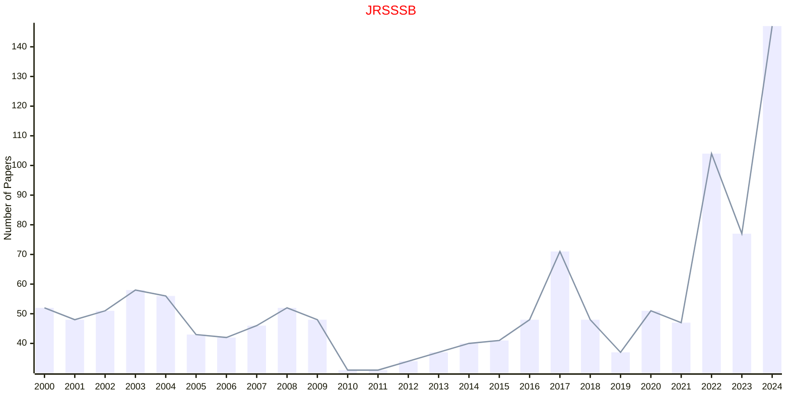

# Statistical Methodology

## JRSSSB

|Publishers|Full/Homepage|Abbr/About|Acronym/Issues|Period/DBLP|Top/Early|CCF|CAS|JCR|IF|Keywords/Google|
|-         |-            |-         |-             |-          |-        |-  |-  |-  |- |-              |
|[OXFORD](https://academic.oup.com/)|[Journal of the Royal Statistical Society Series B: Statistical Methodology](https://academic.oup.com/jrsssb)|[J. R. Stat. Soc. Ser. B](https://academic.oup.com/jrsssb/pages/about)|[JRSSSB](https://academic.oup.com/jrsssb/issue)|1934 -|True||1|Q1|6.7|[Statistical Methodology](https://www.google.com/search?q=Statistical+Methodology)|

