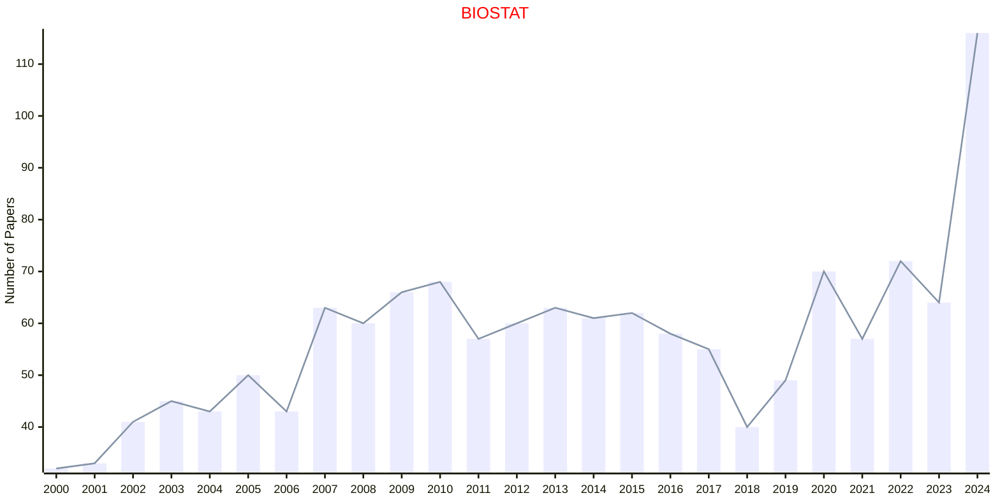

# Statistical Reasoning

## BIOSTAT

|Publishers|Full/Homepage|Abbr/About|Acronym/Issues|Period/DBLP|Top/Early|CCF|CAS|JCR|IF|Keywords/Google|
|-         |-            |-         |-             |-          |-        |-  |-  |-  |- |-              |
|[OXFORD](https://academic.oup.com/)|[Biostatistics](https://academic.oup.com/biostatistics)|[Biostatistics](https://academic.oup.com/biostatistics/pages/about)|[BIOSTAT](https://academic.oup.com/biostatistics/issue)|2000 -|False||3|Q1|2.9|[Statistical Reasoning](https://www.google.com/search?q=Statistical+Reasoning)|

