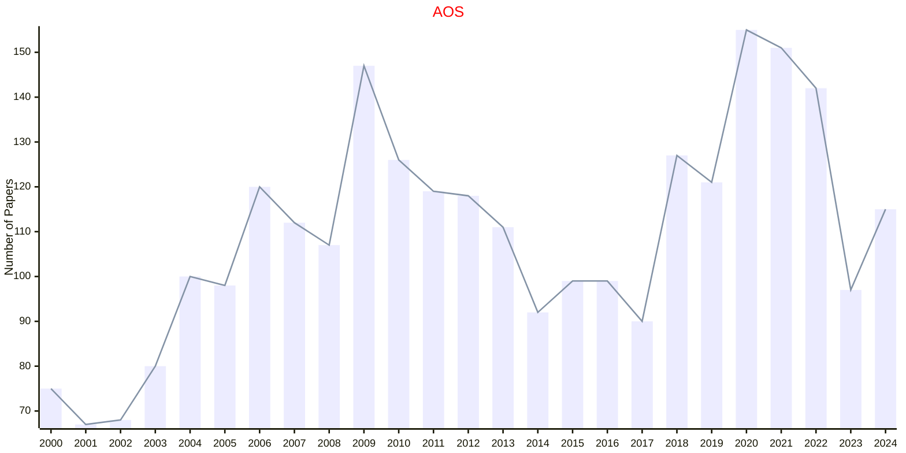
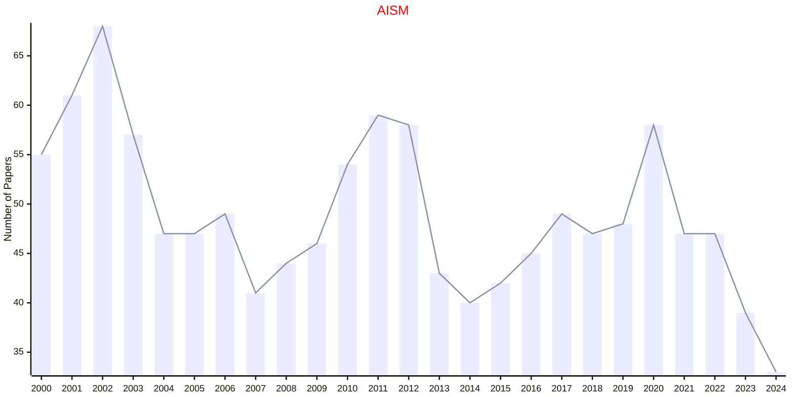
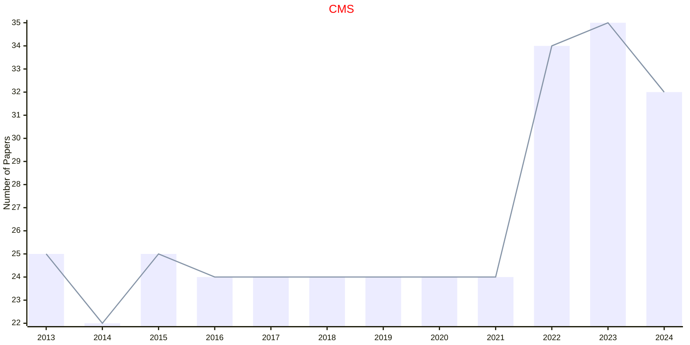
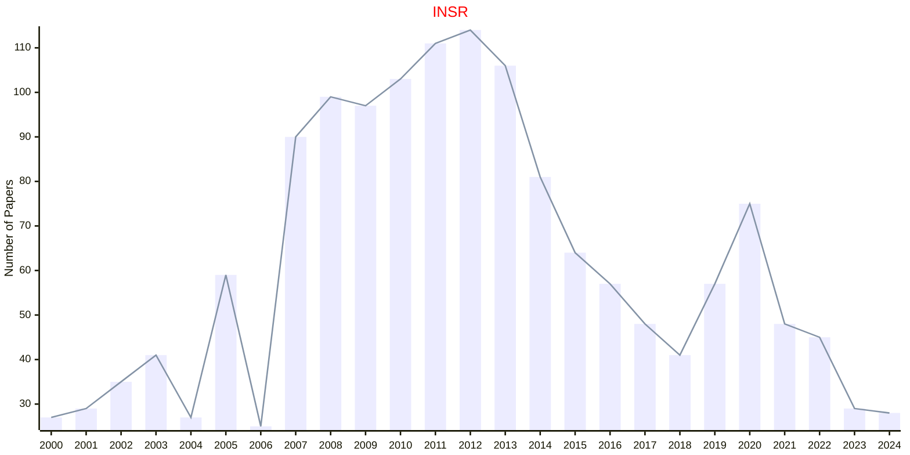
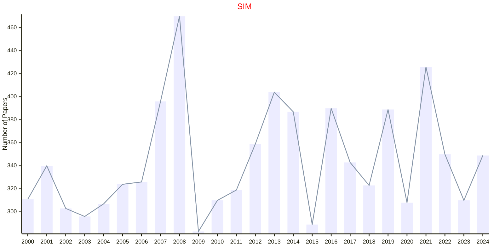
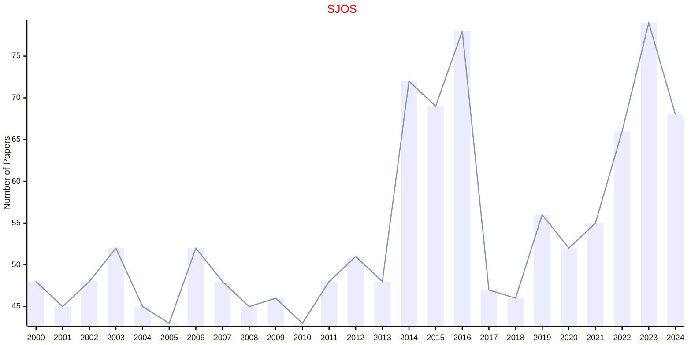

# Statistics

## SS

|Publishers|Full/Homepage|Abbr/About|Acronym/Issues|Period/DBLP|Top/Early|CCF|CAS|JCR|IF|Keywords/Google|
|-         |-            |-         |-             |-          |-        |-  |-  |-  |- |-              |
|[EUCLID](https://projecteuclid.org)|[Statistics Surveys](https://imstat.org/journals-and-publications/statistics-surveys/)|[Stat. Surv.](https://imstat.org/journals-and-publications/statistics-surveys/)|[SS](https://projecteuclid.org/journals/statistics-surveys/issues)|2007 -|False||2||9.4|[Probability and Statistics](https://www.google.com/search?q=Probability+and+Statistics); [Statistics](https://www.google.com/search?q=Statistics)|

## AOS

|Publishers|Full/Homepage|Abbr/About|Acronym/Issues|Period/DBLP|Top/Early|CCF|CAS|JCR|IF|Keywords/Google|
|-         |-            |-         |-             |-          |-        |-  |-  |-  |- |-              |
|[IMS](https://imstat.org/)|[Annals of Statistics](https://imstat.org/journals-and-publications/annals-of-statistics)|[Ann. Stat.](https://imstat.org/journals-and-publications/annals-of-statistics)|[AOS](https://projecteuclid.org/journals/annals-of-statistics/issues)|1973 -|True||1|Q1|5.9|[Statistics](https://www.google.com/search?q=Statistics)|

## AISM

|Publishers|Full/Homepage|Abbr/About|Acronym/Issues|Period/DBLP|Top/Early|CCF|CAS|JCR|IF|Keywords/Google|
|-         |-            |-         |-             |-          |-        |-  |-  |-  |- |-              |
|[SPRINGER](https://www.springer.com/)|[Annals of the Institute of Statistical Mathematics](https://www.springer.com/journal/10463)|[Ann. Inst. Stat. Math.](https://www.springer.com/journal/10463/aims-and-scope)|[AISM](https://link.springer.com/journal/10463/volumes-and-issues)|1949 -|False||4|Q4|1.0|[Statistics](https://www.google.com/search?q=Statistics)|

## CMS

|Publishers|Full/Homepage|Abbr/About|Acronym/Issues|Period/DBLP|Top/Early|CCF|CAS|JCR|IF|Keywords/Google|
|-         |-            |-         |-             |-          |-        |-  |-  |-  |- |-              |
|[SPRINGER](https://www.springer.com/)|[Communications in Mathematics and Statistics](https://link.springer.com/journal/40304)|[Commun. Math. Stat.](https://link.springer.com/journal/40304/aims-and-scope)|[CMS](https://link.springer.com/journal/40304/volumes-and-issues)|2013 -|False||3|Q2|1.0|[Statistics](https://www.google.com/search?q=Statistics)|

## INSR

|Publishers|Full/Homepage|Abbr/About|Acronym/Issues|Period/DBLP|Top/Early|CCF|CAS|JCR|IF|Keywords/Google|
|-         |-            |-         |-             |-          |-        |-  |-  |-  |- |-              |
|[WILEY](https://www.wiley.com/)|[International Statistical Review](https://onlinelibrary.wiley.com/journal/17515823)|[Int. Stat. Rev.](https://onlinelibrary.wiley.com/page/journal/17515823/homepage/productinformation.html)|[INSR](https://onlinelibrary.wiley.com/loi/17515823)|1997 -|False||4|Q1|2.4|[Statistics](https://www.google.com/search?q=Statistics)|

## SIM

|Publishers|Full/Homepage|Abbr/About|Acronym/Issues|Period/DBLP|Top/Early|CCF|CAS|JCR|IF|Keywords/Google|
|-         |-            |-         |-             |-          |-        |-  |-  |-  |- |-              |
|[WILEY](https://www.wiley.com/)|[Statistics in Medicine](https://onlinelibrary.wiley.com/journal/10970258)|[Stat. Med.](https://onlinelibrary.wiley.com/page/journal/10970258/homepage/productinformation.html)|[SIM](https://onlinelibrary.wiley.com/loi/10970258)|1982 -|False||3|Q1|2.6|[Medicine](https://www.google.com/search?q=Medicine); [Statistics](https://www.google.com/search?q=Statistics)|

## SJOS

|Publishers|Full/Homepage|Abbr/About|Acronym/Issues|Period/DBLP|Top/Early|CCF|CAS|JCR|IF|Keywords/Google|
|-         |-            |-         |-             |-          |-        |-  |-  |-  |- |-              |
|[WILEY](https://www.wiley.com/)|[Scandinavian Journal Of Statistics](https://onlinelibrary.wiley.com/journal/14679469)|[Scand. J. Stat.](https://onlinelibrary.wiley.com/page/journal/14679469/homepage/productinformation.html)|[SJOS](https://onlinelibrary.wiley.com/loi/14679469)|1997 -|False||4|Q3|1.2|[Statistics](https://www.google.com/search?q=Statistics)|

