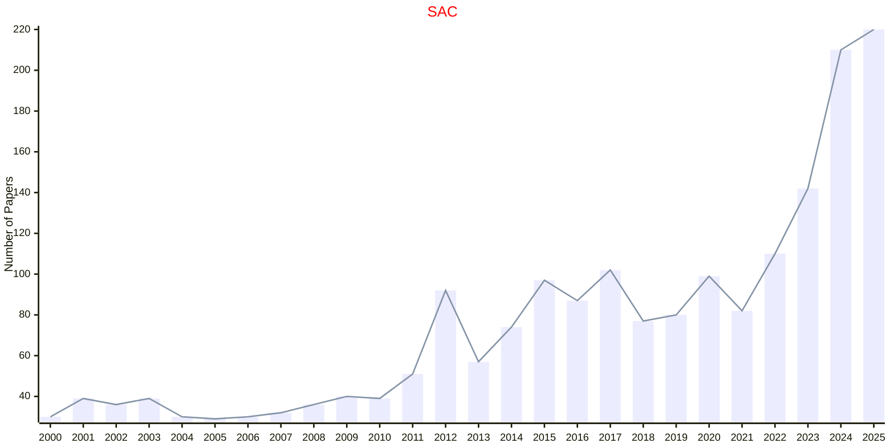

# Statistics and Computing

## SAC

|Publishers|Full/Homepage|Abbr/About|Acronym/Issues|Period/DBLP|Top/Early|CCF|CAS|JCR|IF|Keywords/Google|
|-         |-            |-         |-             |-          |-        |-  |-  |-  |- |-              |
|[SPRINGER](https://www.springer.com/)|[Statistics and Computing](https://www.springer.com/journal/11222)|[Stat. Comput.](https://www.springer.com/journal/11222/aims-and-scope)|[SAC](https://link.springer.com/journal/11222/volumes-and-issues)|1991 -|False||2|Q2|2.2|[Statistics and Computing](https://www.google.com/search?q=Statistics+and+Computing)|

