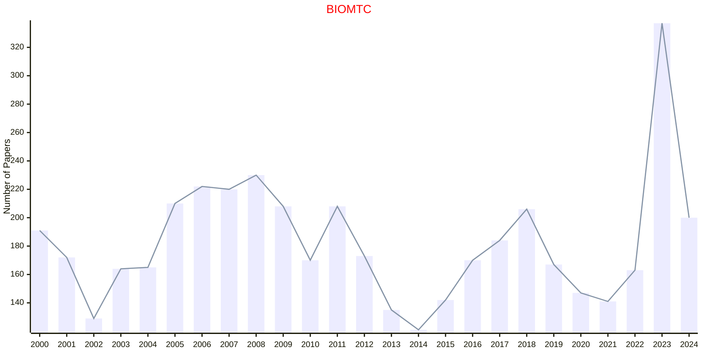

# Statistics in Biosciences

## BIOMTC

|Publishers|Full/Homepage|Abbr/About|Acronym/Issues|Period/DBLP|Top/Early|CCF|CAS|JCR|IF|Keywords/Google|
|-         |-            |-         |-             |-          |-        |-  |-  |-  |- |-              |
|[OXFORD](https://academic.oup.com/)|[Biometrics](https://academic.oup.com/biometrics)|[Biometrics](https://academic.oup.com/biometrics/pages/about)|[BIOMTC](https://academic.oup.com/biometrics/issue)|1999 -|False||3|Q2|2.3|[Statistics in Biosciences](https://www.google.com/search?q=Statistics+in+Biosciences)|

