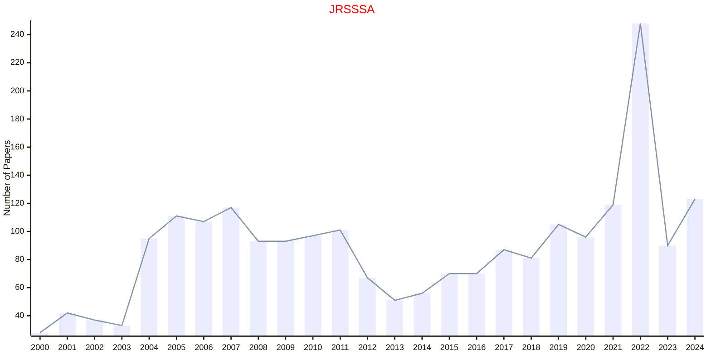

# Statistics in Society

## JRSSSA

|Publishers|Full/Homepage|Abbr/About|Acronym/Issues|Period/DBLP|Top/Early|CCF|CAS|JCR|IF|Keywords/Google|
|-         |-            |-         |-             |-          |-        |-  |-  |-  |- |-              |
|[OXFORD](https://academic.oup.com/)|[Journal of the Royal Statistical Society Series A: Statistics in Society](https://academic.oup.com/jrsssa)|[J. R. Stat. Soc. Ser. A](https://academic.oup.com/jrsssa/pages/about)|[JRSSSA](https://academic.oup.com/jrsssa/issue)|1835 -|False||4|Q2|2.3|[Statistics in Society](https://www.google.com/search?q=Statistics+in+Society)|

