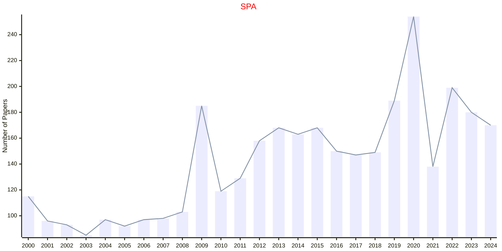

# Stochastic Processes

## SPA

|Publishers|Full/Homepage|Abbr/About|Acronym/Issues|Period/DBLP|Top/Early|CCF|CAS|JCR|IF|Keywords/Google|
|-         |-            |-         |-             |-          |-        |-  |-  |-  |- |-              |
|[ELSEVIER](https://www.sciencedirect.com/)|[Stochastic Processes and their Applications](https://www.sciencedirect.com/journal/stochastic-processes-and-their-applications)|[Stoch. Proc. Appl.](https://www.sciencedirect.com/journal/stochastic-processes-and-their-applications/about/aims-and-scope)|[SPA](https://www.sciencedirect.com/journal/stochastic-processes-and-their-applications/issues)|1973 -|False||3|Q2|1.4|[Stochastic Processes](https://www.google.com/search?q=Stochastic+Processes)|

