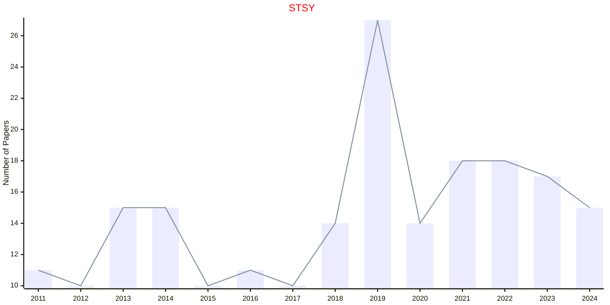

# Stochastic Systems

## STSY

|Publishers|Full/Homepage|Abbr/About|Acronym/Issues|Period/DBLP|Top/Early|CCF|CAS|JCR|IF|Keywords/Google|
|-         |-            |-         |-             |-          |-        |-  |-  |-  |- |-              |
|[INFORMS](https://pubsonline.informs.org/)|[Stochastic Systems](https://pubsonline.informs.org/journal/stsy)|[Stoch. Syst.](https://pubsonline.informs.org/page/stsy/editorial-statement)|[STSY](https://pubsonline.informs.org/loi/stsy)|2011 -|False|||||[Stochastic Systems](https://www.google.com/search?q=Stochastic+Systems)|

