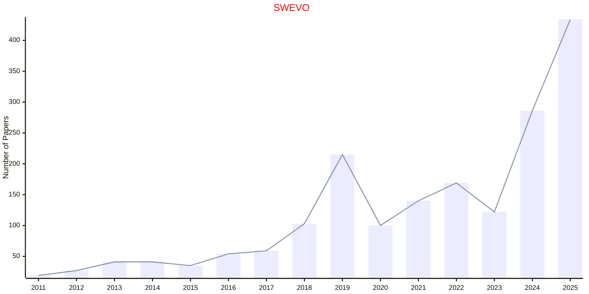
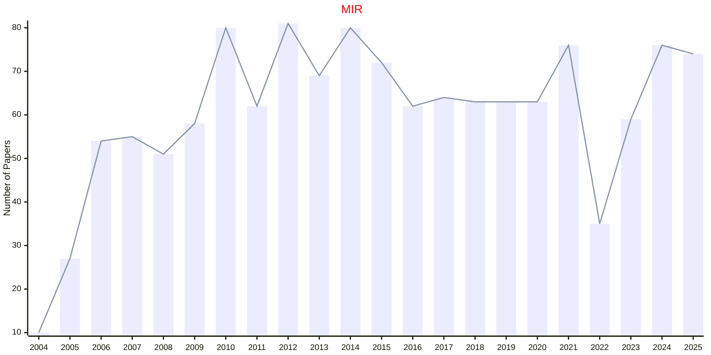
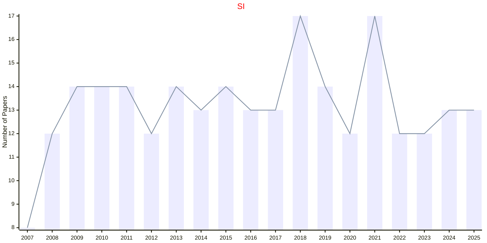
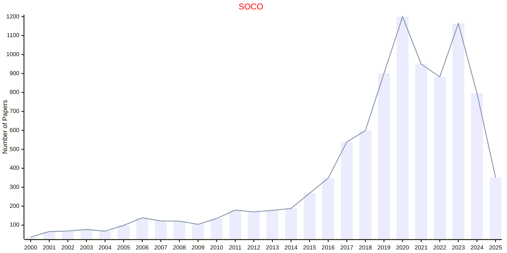

# Swarm Intelligence

## SWEVO

|Publishers|Full/Homepage|Abbr/About|Acronym/Issues|Period/DBLP|Top/Early|CCF|CAS|JCR|IF|Keywords/Google|
|-         |-            |-         |-             |-          |-        |-  |-  |-  |- |-              |
|[ELSEVIER](https://www.sciencedirect.com/)|[Swarm and Evolutionary Computation](https://www.sciencedirect.com/journal/swarm-and-evolutionary-computation)|[Swarm Evol. Comput.](https://www.sciencedirect.com/journal/swarm-and-evolutionary-computation/about/aims-and-scope)|[SWEVO](https://www.sciencedirect.com/journal/swarm-and-evolutionary-computation/issues)|2011 -|False||2|Q1|8.8|[Evolutionary Computation](https://www.google.com/search?q=Evolutionary+Computation); [Swarm Intelligence](https://www.google.com/search?q=Swarm+Intelligence)|

## MIR

|Publishers|Full/Homepage|Abbr/About|Acronym/Issues|Period/DBLP|Top/Early|CCF|CAS|JCR|IF|Keywords/Google|
|-         |-            |-         |-             |-          |-        |-  |-  |-  |- |-              |
|[SPRINGER](https://www.springer.com/)|[Machine Intelligence Research](https://www.springer.com/journal/11633)|[Mach. Intell. Res.](https://www.springer.com/journal/11633/aims-and-scope)|[MIR](https://link.springer.com/journal/11633/volumes-and-issues)|2004 -|False||2||8.7|[Evolutionary Computation](https://www.google.com/search?q=Evolutionary+Computation); [Swarm Intelligence](https://www.google.com/search?q=Swarm+Intelligence)|

## SI

|Publishers|Full/Homepage|Abbr/About|Acronym/Issues|Period/DBLP|Top/Early|CCF|CAS|JCR|IF|Keywords/Google|
|-         |-            |-         |-             |-          |-        |-  |-  |-  |- |-              |
|[SPRINGER](https://www.springer.com/)|[Swarm Intelligence](https://www.springer.com/journal/11721)|[Swarm Intell.](https://www.springer.com/journal/11721/aims-and-scope)|[SI](https://link.springer.com/journal/11721/volumes-and-issues)|2007 -|False||4|Q3|3.0|[Swarm Intelligence](https://www.google.com/search?q=Swarm+Intelligence)|

## SOCO

|Publishers|Full/Homepage|Abbr/About|Acronym/Issues|Period/DBLP|Top/Early|CCF|CAS|JCR|IF|Keywords/Google|
|-         |-            |-         |-             |-          |-        |-  |-  |-  |- |-              |
|[SPRINGER](https://www.springer.com/)|[Soft Computing](https://www.springer.com/journal/500)|[Soft Comput.](https://www.springer.com/journal/500/aims-and-scope)|[SOCO](https://link.springer.com/journal/500/volumes-and-issues)|1997 -|False|C|4|Q3|2.7|[Evolutionary Computation](https://www.google.com/search?q=Evolutionary+Computation); [Swarm Intelligence](https://www.google.com/search?q=Swarm+Intelligence)|

