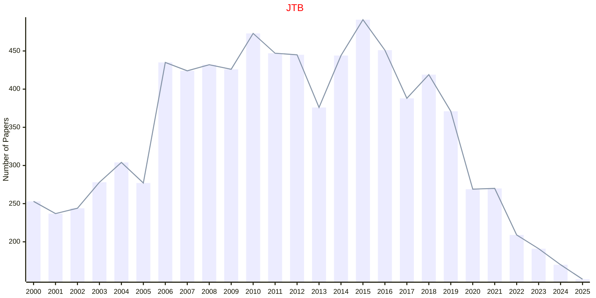

# Theoretical Biology

## JTB

|Publishers|Full/Homepage|Abbr/About|Acronym/Issues|Period/DBLP|Top/Early|CCF|CAS|JCR|IF|Keywords/Google|
|-         |-            |-         |-             |-          |-        |-  |-  |-  |- |-              |
|[ELSEVIER](https://www.sciencedirect.com/)|[Journal of Theoretical Biology](https://www.sciencedirect.com/journal/journal-of-theoretical-biology)|[J. Theor. Biol](https://www.sciencedirect.com/journal/journal-of-theoretical-biology/about/aims-and-scope)|[JTB](https://www.sciencedirect.com/journal/journal-of-theoretical-biology/issues)|1961 -|False||4|Q2|1.9|[Theoretical Biology](https://www.google.com/search?q=Theoretical+Biology)|

