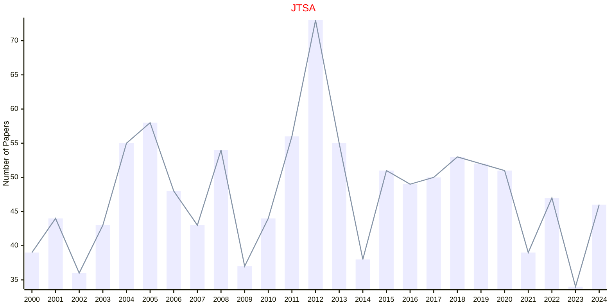

# Time Series

## JTSA

|Publishers|Full/Homepage|Abbr/About|Acronym/Issues|Period/DBLP|Top/Early|CCF|CAS|JCR|IF|Keywords/Google|
|-         |-            |-         |-             |-          |-        |-  |-  |-  |- |-              |
|[WILEY](https://www.wiley.com/)|[Journal of Time Series Analysis](https://onlinelibrary.wiley.com/journal/14679892)|[J. Time Series Anal.](https://onlinelibrary.wiley.com/page/journal/14679892/homepage/productinformation.html)|[JTSA](https://onlinelibrary.wiley.com/loi/14679892)|1980 -|False||4|Q3|1.1|[Time Series](https://www.google.com/search?q=Time+Series)|

