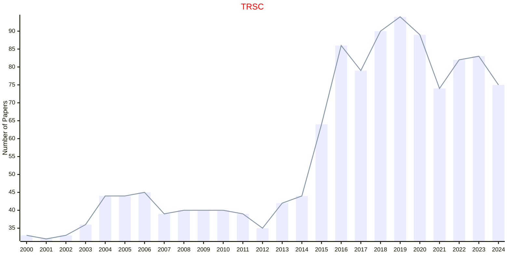

# Transportation

## TRSC

|Publishers|Full/Homepage|Abbr/About|Acronym/Issues|Period/DBLP|Top/Early|CCF|CAS|JCR|IF|Keywords/Google|
|-         |-            |-         |-             |-          |-        |-  |-  |-  |- |-              |
|[INFORMS](https://pubsonline.informs.org/)|[Transportation Science](https://pubsonline.informs.org/journal/trsc)|[Trans. Sci.](https://pubsonline.informs.org/page/trsc/editorial-statement)|[TRSC](https://pubsonline.informs.org/loi/trsc)|1967 -|False||2|Q1|6.2|[Transportation](https://www.google.com/search?q=Transportation)|

