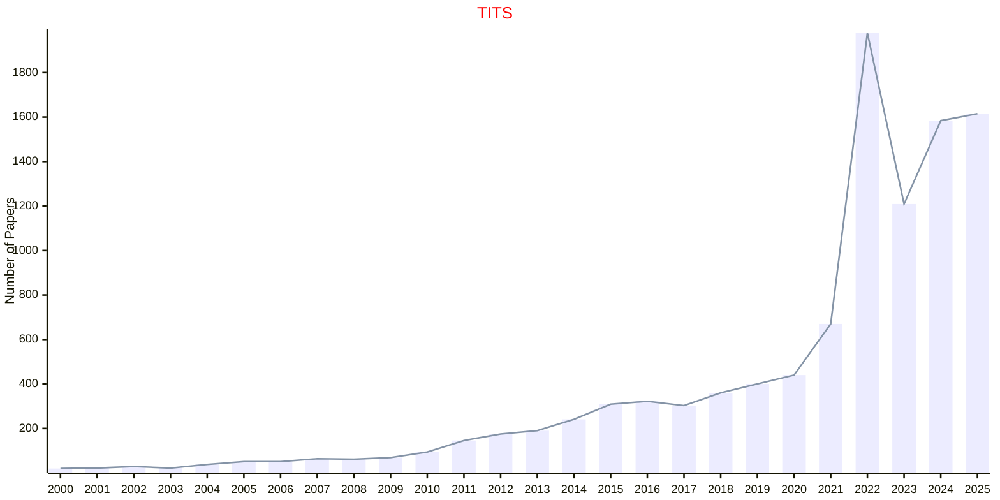

# Transportation Systems

## TITS

|Publishers|Full/Homepage|Abbr/About|Acronym/Issues|Period/DBLP|Top/Early|CCF|CAS|JCR|IF|Keywords/Google|
|-         |-            |-         |-             |-          |-        |-  |-  |-  |- |-              |
|[IEEE](https://ieeexplore.ieee.org/)|[IEEE Transactions on Intelligent Transportation Systems](https://ieeexplore.ieee.org/xpl/RecentIssue.jsp?punumber=6979)|[IEEE Trans. Intell. Transp. Syst.](https://ieeexplore.ieee.org/xpl/aboutJournal.jsp?punumber=6979)|[TITS](https://ieeexplore.ieee.org/xpl/issues?punumber=6979&isnumber=10621861)|2000 -|[True](https://ieeexplore.ieee.org/xpl/tocresult.jsp?isnumber=4358928)|B|2|Q1|9.5|[Transportation Systems](https://www.google.com/search?q=Transportation+Systems)|

