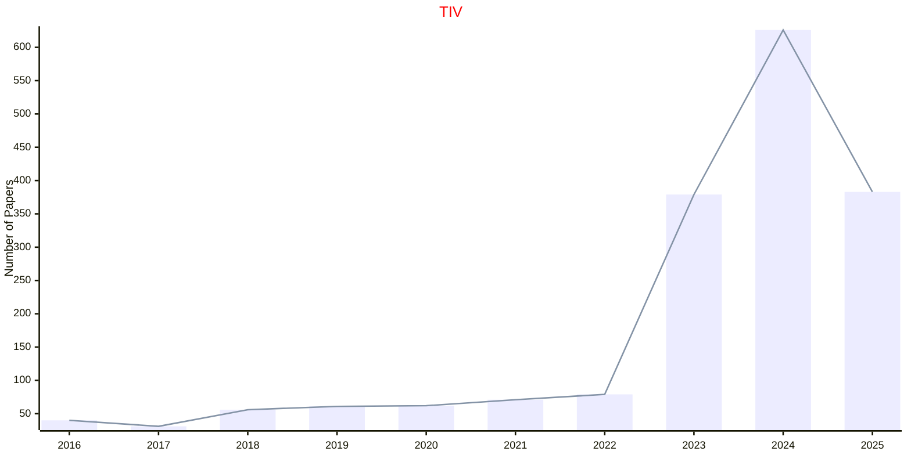
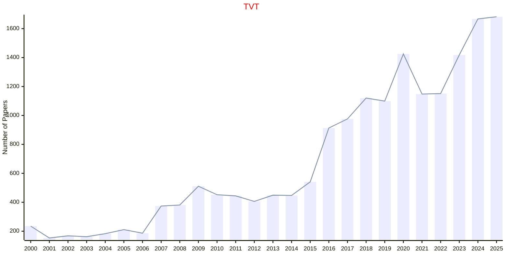

# Vehicles and Vehicular Systems

## TIV

|Publishers|Full/Homepage|Abbr/About|Acronym/Issues|Period/DBLP|Top/Early|CCF|CAS|JCR|IF|Keywords/Google|
|-         |-            |-         |-             |-          |-        |-  |-  |-  |- |-              |
|[IEEE](https://ieeexplore.ieee.org/)|[IEEE Transactions on Intelligent Vehicles](https://ieeexplore.ieee.org/xpl/RecentIssue.jsp?punumber=7274857)|[IEEE Trans. Intell. Veh.](https://ieeexplore.ieee.org/xpl/aboutJournal.jsp?punumber=7274857)|[TIV](https://ieeexplore.ieee.org/xpl/issues?punumber=7274857&isnumber=10631803)|2016 -|[True](https://ieeexplore.ieee.org/xpl/tocresult.jsp?isnumber=7448921)||1|Q1|13.1|[Vehicles and Vehicular Systems](https://www.google.com/search?q=Vehicles+and+Vehicular+Systems)|

## TVC

|Publishers|Full/Homepage|Abbr/About|Acronym/Issues|Period/DBLP|Top/Early|CCF|CAS|JCR|IF|Keywords/Google|
|-         |-            |-         |-             |-          |-        |-  |-  |-  |- |-              |
|[IEEE](https://ieeexplore.ieee.org/)|[IEEE Transactions on Vehicular Communications](https://ieeexplore.ieee.org/xpl/RecentIssue.jsp?punumber=10785)|[IEEE Trans. Veh. Commun.](https://ieeexplore.ieee.org/xpl/aboutJournal.jsp?punumber=10785)|TVC|1963 - 1966|False|||||[Vehicles and Vehicular Systems](https://www.google.com/search?q=Vehicles+and+Vehicular+Systems)|

## TVT

|Publishers|Full/Homepage|Abbr/About|Acronym/Issues|Period/DBLP|Top/Early|CCF|CAS|JCR|IF|Keywords/Google|
|-         |-            |-         |-             |-          |-        |-  |-  |-  |- |-              |
|[IEEE](https://ieeexplore.ieee.org/)|[IEEE Transactions on Vehicular Technology](https://ieeexplore.ieee.org/xpl/RecentIssue.jsp?punumber=25)|[IEEE Trans. Veh. Technol.](https://ieeexplore.ieee.org/xpl/aboutJournal.jsp?punumber=25)|[TVT](https://ieeexplore.ieee.org/xpl/issues?punumber=25&isnumber=10606142)|1967 -|[False](https://ieeexplore.ieee.org/xpl/tocresult.jsp?isnumber=4356907)||2|Q1|7.4|[Vehicles and Vehicular Systems](https://www.google.com/search?q=Vehicles+and+Vehicular+Systems)|

